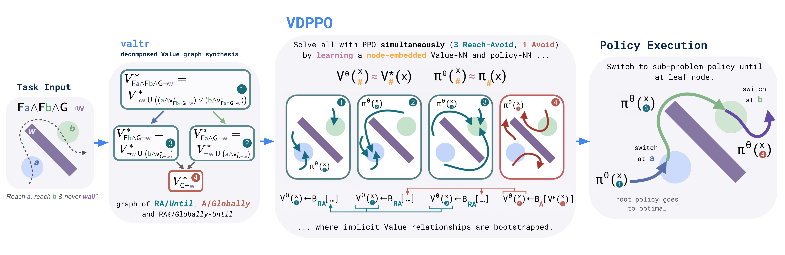

# VDPPO

This repo contains the jax code for Value Decomposition PPO from [Bellman Value Decomposition for Task Logic](https://willsharpless.github.io/valdec-site/) \[RSS '26\]. The algorithm relies on [valtr](https://willsharpless.github.io/valtr/) to generate the decomposed Value graph (DVG).

## basic summary

For given temporal logic, this PPO variant decomposes the Value into a graph of "atomic" Bellman equations (BEs) (via [valtr](https://willsharpless.github.io/valtr/)) and learns an actor and critic for all policies and Values concurrently by embedding (one-hot) the graph. 



This involves distributing rollouts across all nodes and using the corresponding BE for each node to compute the batched target. To compute the BE for each node, the necessary child/dependent Values (based on DVG) are bootstrapped with the current embedded approximation.

### setup
``` 
conda env create -f conda/make_env.yml  # jax env
pip install -e .
```

### run, eg.
```
python scripts/train.py ALG --name test --debug --env-name ENV --n-train-steps 30000
```
where `ALG` is, for example, `vdppo`, `lcrl` or `mppi`. `ENV` is for example `herding`, `delivery` (sim), `deliveryreal` (hardware), `manip_scene`, `gridworld_map[N]` or `ablation`. Use the `--help` flag to see more options.

### testing

If you'd like to make your own env, see `herd_base.py` (which defines `HerdBase` from `BaseEnv`). Here, dynamics/step, reset, obs and basic predicates are defined. Note, there is also a wrapper for each env, eg. `herding.py`. See `get_env.py` for env registration.

If you'd like to mess with the training, see the training agent classes, eg. `vdppo.py`.
